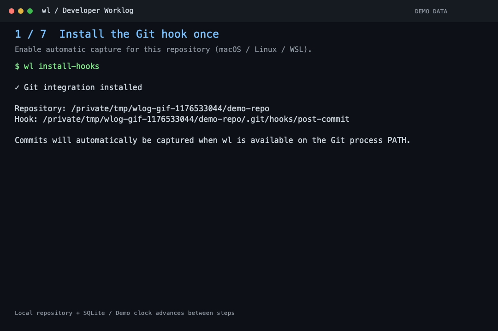
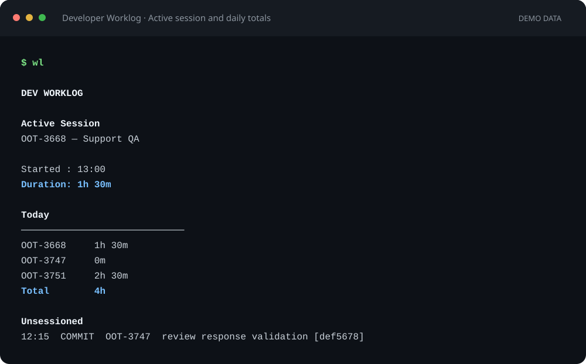
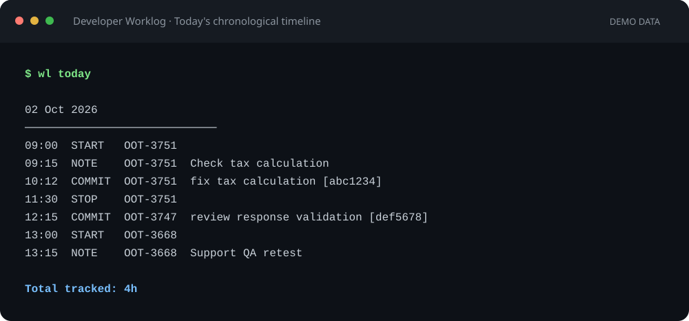
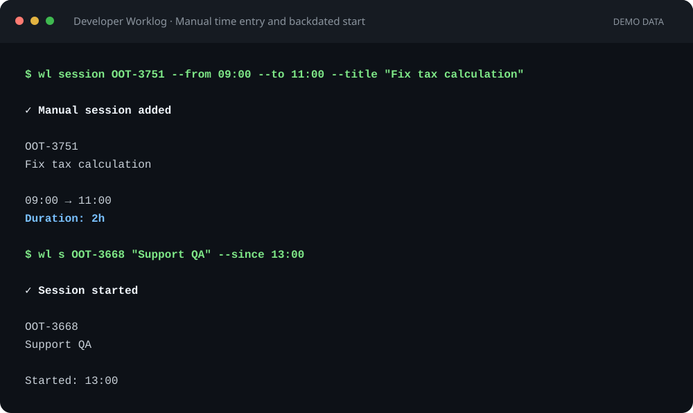

# Developer Worklog CLI

`wl` is a local CLI for tracking developer work sessions by ticket, using a SQLite database and local configuration.

## Features

- **Dashboard** — View the active session, elapsed time, and today's tracked time per ticket with `wl`.
- **Repository status** — Show the dashboard and check automatic commit capture for the current repository with `wl status`.
- **Daily timeline** — Review `START`, `NOTE`, `COMMIT`, and `STOP` events in chronological order with `wl today`.
- **Daily summary** — Select a date from the current week with `wl summary` and copy the combined work details, tracked time, and Git developer email.
- **Work sessions** — Start and stop ticket-based sessions with `wl start` / `wl s` and `wl stop` / `wl x`.
- **Manual time entry** — Add completed sessions with `wl session --from --to --title`, or backdate an active session with `wl s --since`; overlapping ranges are rejected.
- **Activity notes** — Record investigation details and other work on the active session with `wl note` / `wl n`.
- **Git commit capture** — Capture the latest commit, ticket association, changed files, and line statistics with `wl git`, with duplicate capture prevention.
- **Automatic Git hooks** — Install automatic post-commit capture with `wl install-hooks` on macOS, Linux, or WSL.
- **Local storage** — Automatically initialize SQLite storage and configuration; reuse tickets across sessions and repositories.
- **Windows build support** — Build the core CLI as `wl.exe` for Windows x64; runtime verification on Windows is pending.

### Feature Previews

These examples use demo data and show output from the CLI.

**Animated workflow — commit capture, dashboard, and session notes**



The demo installs `wl install-hooks` once in a temporary repository, then makes a real commit. The local Git `post-commit` hook captures it automatically, so no manual `wl git` command is needed. With no active session, the commit appears in the daily timeline and contributes to its ticket’s commit count on the dashboard. The demo then starts a session, adds a note, stops it, and reviews the timeline. The demo clock advances between steps; commits and notes do not add tracked time. Automatic hook installation is available on macOS, Linux, and WSL; the installer records the binary's absolute path so commits from terminals and editors can use it.

**Dashboard — active session and daily totals**



**Daily timeline — sessions, notes, and commits in chronological order**



**Manual time entry — completed sessions and backdated starts**



## Prerequisites

- Go 1.22 or later
- macOS, Linux, or Windows x64 (native core CLI; automatic hook installation requires macOS/Linux or WSL)
- Git with offline capture support (`--no-lazy-fetch`) for `wl git`; the implementation has been verified with Git 2.52.0
- An internet connection for downloading Go modules during the first build

## Installation

### macOS and Linux

Clone the repository and build an executable named `wl`:

```sh
git clone https://github.com/taupikpirdian/wlog.git
cd wlog
mkdir -p "$HOME/.local/bin"
go build -o "$HOME/.local/bin/wl" ./cmd/wlog
```

Make sure `~/.local/bin` is on your `PATH`. For the current terminal session:

```sh
export PATH="$HOME/.local/bin:$PATH"
```

To make this permanent in Zsh (the default shell on macOS), add the export line to `~/.zshrc` and reload it:

```sh
echo 'export PATH="$HOME/.local/bin:$PATH"' >> ~/.zshrc
source ~/.zshrc
```

Run the `echo` command once to avoid duplicate entries. New terminal sessions will load this setting automatically. For Bash, add the same export line to `~/.bashrc` and run `source ~/.bashrc`.

Verify the installation:

```sh
wl --version
wl --help
```

Local builds display `dev` as the version. Release builds can embed a version number using Go linker flags.

### Windows (PowerShell)

Install Go 1.22 or later using the Windows x64 installer from [Go downloads](https://go.dev/dl/), and install [Git for Windows](https://git-scm.com/download/win). Open a new PowerShell window after installation, then verify both tools:

```powershell
go version
git --version
```

Clone the repository and build `wl.exe` in a directory under your Windows user profile:

```powershell
git clone https://github.com/taupikpirdian/wlog.git
Set-Location wlog

$wlInstallDir = Join-Path $env:USERPROFILE ".local\bin"
New-Item -ItemType Directory -Force -Path $wlInstallDir | Out-Null
go build -o (Join-Path $wlInstallDir "wl.exe") ./cmd/wlog
```

Add the directory to the current PowerShell session's `PATH`:

```powershell
$env:Path = "$wlInstallDir;$env:Path"
wl --version
wl --help
```

To make it available in future terminals, add the directory to your user `PATH` without replacing its existing entries:

```powershell
$wlUserPath = [Environment]::GetEnvironmentVariable("Path", "User")
if ($wlInstallDir -notin ($wlUserPath -split ";")) {
    [Environment]::SetEnvironmentVariable("Path", "$wlUserPath;$wlInstallDir".Trim(";"), "User")
}
```

Restart your terminal application, then run:

```powershell
wl
wl s OOT-3751 "Fix tax calculation"
wl n "Check tax calculation"
wl today
wl x
```

The default configuration and database are stored in `%USERPROFILE%\.worklog\config.yaml` and `%USERPROFILE%\.worklog\worklog.db`. Native Windows builds include sessions, manual time entry, notes, the dashboard, today's timeline, and manual Git capture with `wl git`.

`wl install-hooks` and its alias return an unsupported-platform error on native Windows without modifying hooks. Use `wl git` for manual capture, or use the WSL installation below for automatic hook installation. Windows x64 cross-compilation has been verified; runtime behavior has not yet been tested on a Windows machine.

### Windows with WSL

To use the Linux version, including automatic hook installation, install WSL from an administrator PowerShell window:

```powershell
wsl --install -d Ubuntu
```

Follow the setup prompts and restart if requested. See [Microsoft's WSL installation guide](https://learn.microsoft.com/en-us/windows/wsl/install) for system requirements and troubleshooting.

Inside the Ubuntu terminal, install Go 1.22 or later using the [Go installation instructions](https://go.dev/doc/install) and install Git. Then follow the macOS/Linux build and `PATH` steps above inside WSL. Build and run the Linux `wl` executable in that environment for `wl install-hooks`. WSL uses its Linux home directory and a separate `~/.worklog` database by default.

## Usage

Run without arguments to view the active session dashboard and today's tracked time:

```sh
wl
```

On first use, `wl` creates:

```text
~/.worklog/
├── config.yaml
└── worklog.db
```

Subsequent runs reuse the same configuration and database and apply any pending migrations. On macOS and Linux, new directories and files use permissions restricted to the current user. On Windows, access follows Windows folder permissions; Unix permission bits do not set Windows ACLs.

The dashboard displays the active session's ticket, title, repository folder name, start time, and elapsed duration, followed by today's tracked time per ticket. Each ticket lists the repository folder names associated with its sessions and activities today, followed by the title of its first session contributing to today. Tickets without a session show the subject of their first commit today; ties use the lowest stored ID, and missing titles display `-`. This also applies to `wl status`. When there is no work, it displays `No active session` and a total of `0m`. Sessions spanning midnight contribute only the portion that falls within today; the active session's elapsed duration still includes all time since it started.

Review today's events:

```sh
wl today
```

The timeline displays `START`, `NOTE`, `COMMIT`, and `STOP` in chronological order, with a ticket and repository folder name on each line, for example `[repo: wlog]`. Repository names come from the stored activity or session, so records from different repositories retain their own labels regardless of your current directory. Records without repository information display `[repo: -]`. Dates and times use the device's local time zone, and all repositories in the user's database are included. Active sessions do not receive an artificial `STOP` event.

Notes and commits provide evidence and do not add tracked time. Each dashboard ticket shows its commit count for today when it has commits, including commits without a session. Commit details are available in `wl today`; commits without a ticket also appear under `Unassigned` on the dashboard. Daily durations are summed in seconds before being displayed in minutes, so the total may differ from the sum of the displayed minutes for individual tickets.

Both commands read a single consistent snapshot without changing work data, invoking Git, or accessing the network. Multiline notes and commit messages are displayed as a safe single line; their stored contents remain intact. Read failures produce a non-zero exit status rather than an empty view.

View help and version information at any time:

```sh
wl --help
wl help
wl --version
wl version
```

Help and version commands do not create or open the database.

## Creating a Daily Summary

```bash
wl summary
```

The command lists Monday through Sunday of the current week in your local timezone, including dates with no worklog. Enter a date's number and press Enter to select it, or enter `q` to cancel. Each date shows its tracked duration; dates with notes or commits but no tracked sessions show `0m`.

After selecting a date, select a ticket with worklog on that date, then answer `Generate summary with AI? [y/N]`. Selecting No uses the existing plain-text summary for **that date and ticket**, ready to copy:

```text
Time:
2h (3 commits)

Generated for Logs:
Detail:
- Fix tax calculation
- Check tax calculation

Result:
-

Dev By:
developer@example.com
```

Time includes the captured commit count for the selected date and ticket, including commits without a session: `1 commit` or `3 commits`. Zero counts are omitted. Counts come from stored activities, independently of AI output and whether Git evidence can be loaded.

Time is the sum of the selected ticket's session durations within that date. Sessions crossing midnight are split between dates, and active sessions count up to the command's read time. Detail combines session titles, notes, and commit messages in chronological order, splitting multiline text into bullets and removing identical details after whitespace normalization. Notes and commits do not add tracked time. An empty date produces `0m` and `-` for Detail. Dates containing only unassigned evidence retain the date-wide non-AI summary because no ticket can be selected.

Dev By comes from `git config user.email` in the current directory, falling back to `git config --global user.email` when empty or unset. If neither provides an email, it shows `-`. The selection menu is written to stderr; stdout contains only the summary, so you can also save it with `wl summary > summary.txt`.

After a successful summary, a GitHub star invitation appears once at the end on stderr, separated by a blank line. It applies to AI and non-AI summaries and stays outside the copyable Jira output. Failed or canceled commands do not show it.

AI output separates `Generated for Logs:` from `Generated for Details Ticket:`. The ticket heading is followed by `Powered by Enforge Skills, created by rfanazhari`, then a blank line before the generated content. The ticket section uses the same installed `ticket-generator` skill resolution and Jira-ready generation as `wl gt`, preserving its title, sections, and QA tables. It uses the complete recorded ticket history; the logs and commit count remain scoped to the selected date. If the skill is unavailable, the same explicit built-in fallback as `wl gt` applies. Summary generation performs the worklog analysis followed by one ticket generation invocation.

### Optional AI summary

```bash
wl config ai
wl summary
```

`wl config ai` selects Codex, Claude, OpenCode, or Custom, and saves its executable in the existing `~/.worklog/config.yaml`. Install and authenticate the selected CLI before generating. If you choose AI without configuring a provider, `wl summary` offers this same wizard and resumes after saving. Declining configuration falls back to the selected ticket's non-AI summary.

Before AI generation, choose the output language: **Bahasa Indonesia** (1, default) or **English** (2). This choice applies to both the worklog summary and ticket description, across all repositories and providers. Prompts and the `ticket-generator` methodology use the selected language while preserving Jira headings, JSON field names, code identifiers, duration, and developer email. Non-AI summaries retain the original recorded worklog descriptions without translation.

After choosing the output language in `wl summary`, you can enter optional additional context for this generation. Paste investigation results, explanations, or document contents across multiple lines; blank lines between paragraphs are retained. Enter a single `.` on its own line to finish, press Enter before entering text to skip, or enter `q` before the first line to cancel. For long reports or logs with very long lines, enter `@/path/to/context.md` as the first line to read a UTF-8 text file directly. Relative paths, `~/` paths, and quoted paths with spaces are supported. File input finishes after that one line; no `.` terminator is needed, and the file is not modified. Pasted and file input are limited to 64 KiB.

```text
Additional context for this summary (optional, not saved to the database):
Paste text across multiple lines, or enter @/path/to/context.md to read a text file.
For pasted text, enter a single . to finish. Press Enter to skip, or q to cancel before entering text.
> Observed HTTP 400 during bindOTP.

The callback failure still needs investigation.
.
```

This context is held in memory and sent to both the worklog analysis and ticket-description generation for the selected date/ticket. It is never added to notes, sessions, config, or the database, and the next run starts without it. AI treats it as supporting evidence: it can clarify findings but cannot override recorded duration, commit counts, email, Git ranges, or implementation evidence. URLs in additional context follow the same reading and failure-reporting rules as note URLs. For a private document the agent cannot access, paste its relevant contents here. The prompt appears only in the AI summary flow; `wl gt` keeps its existing inputs.

Example configuration (only `provider` is active):

```yaml
ai:
  enabled: true
  provider: codex
  providers:
    codex:
      command: codex
    claude:
      command: claude
    opencode:
      command: opencode
    custom:
      command: my-ai-agent
      args: ["--prompt", "{{prompt}}"]
      progress:
        mode: stderr
```

Custom agents receive the strict prompt on stdin unless an argument includes `{{prompt}}`. Arguments are passed directly to the executable, without shell interpretation. Custom agents must return only valid JSON matching the summary contract: `worklog.details`, `worklog.results`, and `ticket_description` with `background`, `problem_requirement`, `scope`, `expected_result`, and optional `technical_notes`. Details, scope, background, problem, and expected result must be nonempty; results may be `[]` when no outcome is supported. Factual fields such as duration, email, ticket, and date are excluded from the AI response. The subsequent ticket generation invocation returns Jira-ready text using the same contract as `wl gt`. The structured `ticket_description` is retained for adapter compatibility but is replaced in the displayed output by this generated Jira-ready text. Invalid or empty output produces an explicit error rather than a malformed summary.

Notes or additional context containing HTTP(S) URLs add a mandatory reading step to AI generation: the agent must open, read, and analyze each distinct reference before producing the ticket description. Linked documents can supply user analysis, findings, or additional context, including notes from earlier dates in the ticket history. Relevant references appear in Related. Code evidence still takes priority, and linked analysis must not be presented as confirmed implementation without supporting evidence. If a link requires authentication or cannot be read, the ticket must state the limitation instead of inventing content. The same instructions apply to `wl gt`; non-AI summaries do not open links.

When note or additional-context URLs are present, wlog enables Codex live web retrieval, Claude WebFetch for the noted domains, and OpenCode webfetch for the noted URLs. The source inspection permissions remain in place. Custom agents receive the same prompt and must provide their own web-reading capability. Provider availability, site access, and authentication can still prevent retrieval; tests verify prompts and transport permissions with fake local agents, without making paid AI calls or fetching note links.

### Environment Changes

Every `wl summary`, including non-AI generation and AI fallbacks, appends one mandatory `Environment Changes` section. Detection belongs to the application, not the AI. It reads immutable blobs at the selected date/ticket's captured commit ranges using the recorded repository paths; it never substitutes current HEAD or the current directory's unrelated changes.

Candidates come from changed files at the end revision. They are compared with environment names in all supported files at the base revision, so refactors, renames, additional uses, and changed defaults do not create new variables. Names are deduplicated and sorted. Existing `.env.example`, `.env.sample`, `.env.template`, and `example.env` files at the end revision are checked for missing names; absence of a template is allowed.

Built-in extractors support Go `os.Getenv`/`LookupEnv`; JavaScript/TypeScript `process.env`, `Bun.env`, and `Deno.env.get`; Python `os.getenv`/`os.environ`; PHP/Laravel `getenv`, `env`, `$_ENV`, and `$_SERVER`; Java/Kotlin `System.getenv` and literal Spring `@Value`/uppercase `environment.getProperty`; .NET `Environment.GetEnvironmentVariable`; Ruby `ENV`/`fetch`; Rust `std::env::var`/`var_os`; shell declarations; Docker `ENV`/`ARG`/`RUN` references; Compose environment maps/lists; Kubernetes env entries and locally resolvable ConfigMap/Secret `envFrom`; and environment template assignments. Generic .NET `configuration["NAME"]` is accepted only for an explicit environment-only `ConfigurationBuilder().AddEnvironmentVariables().Build()` assigned to `configuration` in the same file. GitHub Actions and GitLab CI variables are listed separately as CI-only.

```text
Environment Changes

New environment variables:
- API_BASE_URL
- CLIENT_ID

Missing from environment template:
- CLIENT_ID
```

A successful empty check prints `No new environment variables detected.` Failed or partial checks print `Environment variable check could not be completed.` Partial checks retain names proven by the available ranges, and never report a successful empty check. Missing captured ranges are unavailable evidence, not proof that no variables were added.

Only names enter the structured detector result, final output, and AI environment context. Configuration diffs are omitted from the summary AI prompt to avoid sending environment values. The old AI `worklog.environment_variables` field remains compatible but is ignored. Other source-code changes remain the implementation evidence.

Detection is static and conservative: dynamically assembled names, aliases, indirect configuration providers, external ConfigMaps/Secrets, shell locals/references without declarations, and unrendered configuration templates cannot always be resolved. Unresolved `envFrom` and parsing/read failures make the check incomplete. Git reads are bounded to 256 KiB per blob/command, revision scans to 2,048 supported files or 8 MiB, and checks to 128 ranges. Dependency trees (`vendor`, `node_modules`) are excluded. Add extractors through `DefaultExtractors` or inject them into the detector without changing the summary command.


The AI output contains the Jira Worklog block followed by the Jira-ready Ticket Description. Worklog scope is the selected date and ticket; ticket description uses all recorded evidence for that ticket. The application formats both outputs and supplies Time and Dev By itself.

Source evidence uses captured `work_activities.commit_hash`, `repository`, and `branch` from the database. The current schema does not record session start/end commit hashes. Each captured commit is analyzed as its **first parent → captured commit** diff (root commits use a root diff), with duplicate resolved hashes removed per repository. This avoids assuming that unrelated commits between two captures belong to the ticket. Capture the commits you want included through `wl git` or the installed hooks; unrecorded commits and uncommitted changes are not included.

Git and agent processes run against the recorded absolute repository path, so running `wl summary` from another directory still works. Multiple repositories are analyzed separately, then their outputs are combined and duplicate bullets removed. The prompt prioritizes actual diffs, related implementation, and tests over notes and messages; it prohibits unsupported claims about tests, deployment, or issue resolution. Files should be inspected at the recorded revision, rather than the current HEAD. This is summary generation, with no code-review output.

Missing repositories, missing commit objects, and diffs exceeding 256 KiB are reported as incomplete evidence; other available repositories still contribute. If no source context can be read, you must explicitly accept worklogs-only AI generation, or fall back to the non-AI summary. Worklogs-only and partial contexts instruct the AI to use conservative wording and avoid claiming code verification. Prompts are bounded at 2 MiB, responses at 4 MiB, and each agent invocation has a ten-minute timeout.

Provider adapters use noninteractive CLI modes documented by [Codex](https://developers.openai.com/codex/noninteractive), [Claude Code](https://code.claude.com/docs/en/cli-reference), and [OpenCode](https://opencode.ai/docs/cli/). Codex uses a read-only sandbox, Claude uses plan permissions, and OpenCode uses its v1 plan-agent permissions. Provider-specific `args` can add options such as model selection. Custom agent behavior is controlled by the configured executable.

### Real-time AI progress

Progress appears on stderr while stdout remains the final Jira summary. `→` lines report actual wlog actions such as loading recorded worklogs, validating repository paths, loading captured commits, starting each repository analysis, and combining results. `[Codex]`, `[Claude]`, `[OpenCode]`, and `[Custom]` lines report observable provider events such as tool invocation, file inspection, and session status. There is no simulated thinking progress. Reasoning blocks, arbitrary tool output, and final response text are excluded from the progress renderer.

Codex streams JSONL with `--json` and keeps the structured result in its separate final-message file. Claude streams `--output-format stream-json --verbose` and extracts the structured result from its result event. OpenCode streams `--format json` events; text events are collected for the final response, while tool and step events become progress. Unknown or malformed progress events are ignored rather than printed as raw transcripts.

Custom providers support `progress.mode: none` (default), `stderr`, or `jsonl`. In `stderr` mode, stdout must contain only the final JSON, and stderr must contain observable progress lines, not reasoning or response text. In `jsonl` mode, stdout emits observable events and a final result event:

```jsonl
{"type":"status","message":"Repository inspected"}
{"type":"tool","name":"git","command":"git diff aaa..bbb"}
{"type":"file","path":"internal/service/auth.go"}
{"type":"result","data":{"worklog":{"details":["Observed change"],"results":[]},"ticket_description":{"background":"Recorded context","problem_requirement":"Observed requirement","scope":["Observed change"],"expected_result":"Expected behavior","technical_notes":""}}}
```

Supported custom event types are `info`, `status`, `warning`, `tool`, `file`, and `result`. With `none`, provider output produces no AI progress events. Provider streams are drained concurrently, with a 1 MiB per-event limit and a 64 KiB stderr diagnostic tail. Known credential values and common token/password/authorization patterns are masked before rendering. Ctrl+C cancels the AI process and closes its streaming readers; on macOS/Linux, its process group is terminated as well. Failures retain a bounded, sanitized diagnostic message.

## Generating a Jira Ticket

```bash
wl generate-ticket
# Same command, short alias:
wl gt
```

Select a ticket directly from tickets with recorded worklogs in the current local Monday–Sunday week; there is no date selection. Each ticket appears once with its total tracked time for that week. The command reuses the existing AI configuration and repository/commit evidence pipeline and writes the final Jira-ready ticket text, including its title, directly to stdout. Generation uses all recorded history for that ticket, including earlier weeks. Missing AI configuration can be completed in the same run. Worklogs-only generation still requires explicit consent when source code is unavailable. If this week has no ticket worklogs, the command reports this before asking for input or starting AI. `wl summary` retains its date selection and structured worklog analysis, then uses the same skill-based ticket generation for its ticket section.

`wl generate-ticket` and `wl gt` offer the same **Bahasa Indonesia** or **English** output-language selection as AI summaries, before any AI process starts. Press Enter to use Bahasa Indonesia.

Before ticket generation, wlog checks for an installed `ticket-generator/SKILL.md` in the recorded repositories and provider's user skill locations until it finds a readable skill. It reads the complete file (up to 256 KiB), displays actual check/read progress, and selects the repository where the skill was resolved as the agent's working directory. The agent receives all recorded repository paths, immutable commit ranges/diffs, worklogs, and sessions and generates one coherent ticket for the entire ticket history. Git continues reading evidence from each database repository path, independently of the user's current directory.

When the skill is loaded, it determines the applicable section structure and conditional QA Impact content. Jira output rules override conflicting skill formatting: use plain titles such as Description, Goal, Findings, Scope, Out of Scope, QA Impact, Acceptance Criteria, and Related, without Markdown heading prefixes. Tables use Jira Wiki syntax with double-pipe headers and single-pipe data rows, without Markdown separator rows. The application rejects empty content, Markdown headings, and invalid table formatting instead of displaying a successful ticket. Valid output is preserved without rewriting technical names or factual claims. If the skill cannot be found or read, progress reports the fallback; the built-in generator uses a plain title and Description, Findings, Scope, Goal, and optional Related sections. No QA Impact placeholder is added.

Keep paragraphs short and wording natural for developers, QA, and non-technical readers. Preserve technical terms, endpoint names, HTTP status codes, error codes, function names, and database/table names. Confirmed findings must be separate from assumptions or further investigation; root cause, successful fixes, deployment, and testing require recorded evidence. Example table syntax:

```text
|| Area || What to Check || Expected Result ||
| OTP & CIAM Binding | Check submit OTP flow and CIAM response | Error flow can be confirmed |
| Orbit Callback | Trace callback process | Failure point can be identified |
```

These example rows illustrate formatting, not findings for a generated ticket.

For native providers, wlog reports that it read the skill and that native loading will be requested; it does **not** claim that the agent already read it. Codex receives `$ticket-generator`, Claude can invoke `Skill`, and OpenCode can invoke `skill` for `ticket-generator`. The prompt requires the agent to read the native instructions (or the verified file directly) before code analysis and follow the skill's final format. Native skill-loading events are streamed only when reported by the provider. Custom agents receive the complete instructions actually read by wlog. Captured Git ranges replace the skill's branch/working-tree comparison inputs; the agent must not invent a base branch or compare against current HEAD.

Ticket generation uses plain Jira-ready text responses without Codex `--output-schema` or Claude `--json-schema`. Event streaming stays enabled and separate from final content. Claude is granted access to other recorded repositories with `--add-dir`; OpenCode uses focused [external-directory permissions](https://opencode.ai/docs/permissions/#external-directories) while keeping modification tools denied. Custom agents must return Jira-ready text on stdout for `wl gt`; in `progress.mode: jsonl`, the final event is `{"type":"result","data":"Ticket title\n\nDescription\n..."}`. The summary command continues to require its JSON response contract.

Skill discovery follows the documented locations for [Codex](https://developers.openai.com/codex/skills), [Claude Code](https://code.claude.com/docs/en/skills), and [OpenCode](https://opencode.ai/docs/skills/), with `~/.codex/skills` also checked for existing Codex installations. Progress stays on stderr, and `wl generate-ticket --help` lists `generate-ticket, gt` as names for the same command.

To diagnose the actual resolver, run `wl skills check ticket-generator`. It reads the instructions and reports the configured provider, checked locations, and loaded path; unreadable or missing skills return a non-zero status with an actionable reason. Use `--provider codex` to select another provider or `--repository /path/to/project` to check a recorded repository. Skill discovery also checks the invocation directory (including `.agents/skills`) independently of the repository used for Git evidence. A skill installed only inside the wlog project is available when invoking from that project; install it in a provider's global skill directory to use it from any directory.

## Tracking Work Sessions

Start a session with a ticket key and an activity title:

```sh
wl start OOT-3751 "Fix tax calculation"
# Alias
wl s OOT-3751 "Fix tax calculation"
```

The ticket is created automatically if it does not exist. The session title does not change the ticket's title. Ticket keys must match `ticket.pattern`, and a session title is required. Configuration and storage are initialized automatically if this is the first command you run.

Only one session can be active across the entire database, including when you switch repositories. If a session is active, `start` displays its details and requests `[Y/n]` confirmation in an interactive terminal. Enter, `y`, or `yes` atomically completes the previous session and starts the new one; `n` or `no` cancels. Piped input and EOF do not provide confirmation.

Starting a session also records its title as a `NOTE` at the session's start time, including when using `--since`. The note inherits the session's ticket and repository and appears immediately in `wl today`. The session and its initial note are saved in one transaction.

Complete the active session:

```sh
wl stop
# Alias
wl x
```

Duration is calculated from the start and end times and stored in seconds. Times are displayed in the device's time zone. If the device clock is earlier than the session's start time, the command returns an error and the session remains active. Running `stop` without an active session also returns an error.

When run inside a Git repository, the session stores the repository's root path. Commands also work outside Git or when Git is unavailable.

## Recording Missed Time

Add a completed session with a time range you specify:

```sh
wl session OOT-3751 --from 09:00 --to 11:00 --title "Fix tax calculation"
```

Or start an active session from an earlier time:

```sh
wl s OOT-3751 "Fix tax" --since 09:00
# Shorthand flag
wl s OOT-3751 "Fix tax" -s 09:00
```

Times must use the exact `HH:mm` format on today's local date. Future times, empty or reversed completed ranges, and ambiguous or nonexistent local times caused by time zone offset changes are rejected. There is no automatic rollover to yesterday or across midnight; duration is calculated from actual elapsed time without AI estimation.

Both operations reject overlaps with sessions on any ticket or repository. Ranges that only touch at their boundaries are allowed. `--since` requires no active session and does not offer to switch sessions; starting without this flag retains the existing confirmation behavior. A completed manual session can be added before an active session's start time without changing that active session.

New sessions appear immediately in the dashboard and timeline. Existing notes and commits are not moved into the new session, even if their times and tickets match. Tickets and sessions are stored atomically; a successful command creates one session. If output fails after storage succeeds, review `wl` or `wl today` before retrying because the session may already be stored and a retry will be rejected as a conflict.

## Adding Activity Notes

While a session is active, record investigation context or work beyond coding:

```sh
wl n "Check Splunk logs"
wl note "Found response mismatch"
wl n "Support QA retest"
```

Each command stores one `NOTE` activity on the active ticket and session, then displays `✓ Note added to <ticket>`. Text must be provided as a single argument; leading and trailing whitespace is trimmed, and empty descriptions are rejected. Notes with identical text may be added multiple times.

Notes work outside Git and inherit the active session's repository context. Adding a note does not change the session's duration. Without an active session, the command fails and suggests `wl s <ticket> "<title>"`. If the session changes during storage, the command fails; retry to use the latest session.

## Capturing Git Commits

Inside a repository that already has a commit, run:

```sh
wl git
```

The command captures the latest HEAD along with its message, branch when available, changed files, text line statistics, and commit time. The ticket is selected in this order: commit message, active session, branch, then `UNASSIGNED`. If the ticket matches the active session, the commit is linked to that session. Otherwise, it is stored under its ticket without a session and a warning is displayed.

Commits can be captured without an active session and do not add tracked time. Capturing the same repository and hash again displays `✓ Commit already captured.` without duplicating or moving the existing record.

`capture_changed_files` and `capture_diff_stat` can be disabled independently. Statistics exclude `.env*` contents; binary files do not contribute to text line counts. Full diffs are not collected, even when `capture_full_diff: true` is configured—the command displays a warning and still stores metadata. Unavailable supplementary metadata produces warnings; Git identity or storage failures produce a non-zero exit status.

## Installing Automatic Git Hooks

Automatic installation is available on macOS and Linux, including Linux inside WSL. Native Windows users can capture commits with `wl git`.

Check the current repository's integration alongside the work dashboard:

```sh
wl status
```

The status shows the repository and whether its managed `post-commit` hook is installed, along with the capture executable's path. If it is missing, it suggests `wl install-hooks`; if executable permissions are missing, it suggests the same command to repair them. Legacy hooks that depend on Git's `PATH` display a suggestion to upgrade using `wl install-hooks`. Modified or conflicting hooks and custom `core.hooksPath` settings are reported as unverified. Outside a Git worktree, when Git is unavailable, or on unsupported platforms, the dashboard still appears with an explanation that hook status is unavailable. Checking status does not install or modify hooks.

Run `wl install-hooks` once in each repository where you want automatic capture. Other repositories remain unaffected; linked worktrees sharing the same default hooks directory share the installation.

Run from the root or a subdirectory of a Git repository:

```sh
wl install-hooks
# Alias
wl install-hook
```

The installer places a `post-commit` hook in Git's default hook directory, including for repositories with no commits yet. Output shows the repository, hook path, and capture executable. Installation does not create configuration or a database, or perform a capture. The hook records the absolute path of the binary running `wl install-hooks`. For a binary installed at `/Users/example/.local/bin/wl`, subsequent commits run:

```sh
'/Users/example/.local/bin/wl' git >/dev/null 2>&1 || true
```

Run the installer using your permanently installed binary, rather than `go run` or a temporary build. Commits from terminals and editors such as VS Code use that binary without requiring `~/.local/bin` on the editor's `PATH`. Git must still be available to the hook. Keep the binary at the recorded location; if you move it, rerun `wl install-hooks` using the new binary. Capture output is discarded; capture failures or a missing executable do not cancel the commit. Manual capture with `wl git` remains available and captures only the current HEAD commit.

An existing hook that is a regular file is copied intact to the sibling file `post-commit.wlog-original`, preserving its read, write, and execute permissions. An executable original hook runs before capture, retaining its output and exit status. A nonexecutable original is preserved without being run. Because the original runs from its backup filename, hooks that depend on `$0` or their basename require manual integration.

Reinstalling a valid wrapper displays `already installed` without duplicating capture. Rerunning the installer upgrades an intact legacy wrapper to use the installed binary's absolute path, or updates the path after moving the binary, while preserving the existing original-hook backup. Missing executable permissions are repaired. Default hooks for linked worktrees are shared across the repository's worktrees; this scope is shown in the output.

A configured `core.hooksPath`, symlink or nonregular hook, reserved backup that conflicts with a new installation, or modified managed wrapper or backup is rejected with an error. For a custom hook manager or path, manually add the capture command above to the hook you manage, using your binary's actual absolute path. The installer does not change Git configuration.

Installation uses a lock and atomic publication. Stale locks or recovery files left after a crash require manual inspection using the paths shown in the error. The lock coordinates `wl` installers; detected changes by another editor abort installation, but that editor may still race with installation after the final check.

## Running from Source

To run directly without installing an executable:

```sh
go run ./cmd/wlog
```

Or build in the repository directory:

```sh
go build -o ./wl ./cmd/wlog
./wl
```

## Configuration

The configuration file is created automatically at `~/.worklog/config.yaml`:

```yaml
database:
  path: ~/.worklog/worklog.db

ticket:
  pattern: "[A-Z][A-Z0-9]+-[0-9]+"

git:
  capture_changed_files: true
  capture_diff_stat: true
  capture_full_diff: false

ai:
  enabled: true
  include_diff: false
```

Existing values are preserved when `wl` is run again. `capture_full_diff` and `include_diff` are disabled by default.
